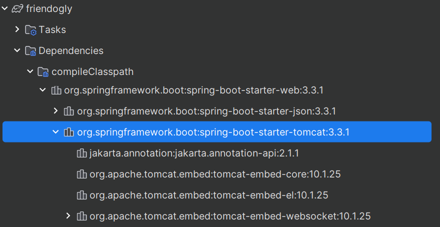
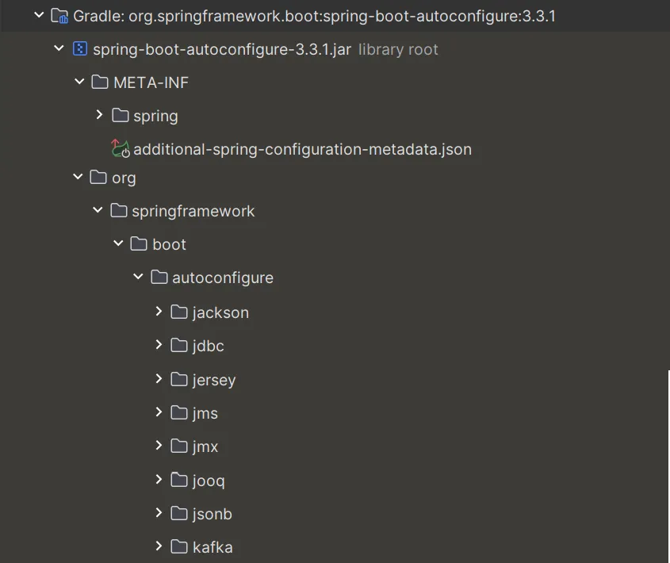

# 스프링 부트 알아보기

## 스프링 부트란?

스프링 부트는 스프링 기반 애플리케이션을 더 편하고 빠르게 개발할 수 있도록 도와주는 도구이다.
[스프링 부트 공식 문서](https://spring.io/projects/spring-boot)에서는 다음과 같이 소개하고 있다.

> Spring Boot makes it easy to create stand-alone, production-grade Spring based Applications that you can "just run".
>
> We take an opinionated view of the Spring platform and third-party libraries so you can get started with minimum fuss. Most Spring Boot applications need minimal Spring configuration.

스프링 부트는 독립 실행형 프로덕션 수준의 Spring 기반 애플리케이션을 쉽게 만들 수 있게 해주고, 스프링 프레임워크와 서드 파티 라이브러리에 대한 명확한 견해를 제공해 최소한의 번거로움으로 시작할 수 있도록 한다고 한다.

무슨 말인지 이해가 되지 않는다면 오히려 좋다.
스프링 부트는 실질적으로 어떤 기능을 제공하는걸까? 스프링 부트의 특징을 살펴보며, 어떻게 이를 가능케 하는지 알아보자.

## 스프링 부트의 특징

스프링 부트의 주요 특징은 다음과 같다.

- 독립 실행형 스프링 애플리케이션 구축
- starter 의존성 제공을 통한 초기 빌드 구성 단순화
- 스프링 및 서드파티 라이브러리의 버전 관리 및 설정 자동 구성
- AutoConfiguration
- 프로덕션에 적합한 기능 제공

### 1. 독립 실행형 스프링 애플리케이션 구축

**1.1. 스프링 프레임워크의 배포 과정**

스프링 프레임워크로 만든 웹 애플리케이션을 배포하려면 별도의 WAS를 설치하고, 애플리케이션을 WAR 파일로 빌드해 WAS에 직접 배포해야 했다.

**1.2. 스프링 부트 내장 톰캣**



스프링 부트는 **내장 톰캣을 라이브러리 형태로 제공**한다.
개발자는 WAS를 따로 설치할 필요 없이 웹 애플리케이션을 독립 실행 가능한 JAR 파일로 패키징할 수 있고, 원하는 환경에서 바로 실행할 수 있다.
WAS를 설치 및 관리해야 하는 번거로운 작업을 최소화해 애플리케이션 개발에만 집중할 수 있게 된다.

### 2. starter 의존성 제공을 통한 초기 빌드 구성 단순화

**2.1. 스프링 프레임워크의 자율성**

스프링 프레임워크는 기본적으로 매우 자유로운 선택지를 제공한다. 개발자는 원하는대로 설정을 변경할 수 있으며, 그 선택지 또한 매우 다양하다.
이는 스프링 프레임워크의 큰 장점이지만, 빠른 애플리케이션 개발을 방해하는 걸림돌이 될 수도 있다.

개발자는 초기 프로젝트 설정을 위해 어떤 라이브러리를 사용할지, 어떤 버전을 사용해야 할지 처음부터 끝까지 결정해야 한다. 빠르게 개발을 시작하고 싶어도 끝없는 의사 결정 과정을 거쳐야만하는 것이다.

**2.2. 스프링 부트 스타터 모듈**

스프링 부트는 이런 문제를 해결하기 위해 **스타터**를 제시한다. 스타터는 best-practice 라고 알려진 라이브러리 의존성을 한데 묶어놓은 것이다.

스프링 부트 프로젝트를 생성할 때 흔히 사용하는 Spring Initializr와 같은 도구를 사용해 `build.gradle` 에 스타터 의존성을 추가할 수도 있다.

**예시**

프로젝트에 JPA를 사용하는 상황을 가정해 `build.gradle`에 `spring-boot-starter-data-jpa` 의존성을 추가해보자.

```sql
dependencies {
    implementation 'org.springframework.boot:spring-boot-starter-data-jpa'
}
```

Intellij를 사용해 `spring-boot-starter-data-jpa` 내부의 의존성을 확인해보면, 다음과 같이 자동으로 의존성이 설정된 것을 확인할 수 있다.


설정된 의존성을 보면 JPA 구현체로 hibernate가, connection pool로 HikariCP가 자동으로 선택된 것을 확인할 수 있다.

이처럼 스프링 부트는 개발에 필요한 초기 의존성을 알아서 결정해준다. 이러한 특징을 **Opinionated** 라고 한다. 개발자가 견해를 가지고 의존성을 결정하듯, 스프링 부트 자체가 강한 견해를 가지고 의존성을 결정하기 때문에 붙은 명칭이다.

스프링 부트가 bast-practice에 따라 미리 의존성을 결정해준 덕분에, 개발자는 라이브러리를 선택하는 의사 결정을 뒤로 미루고 바로 개발을 시작할 수 있게 되었다.
물론 이렇게 결정된 라이브러리 의존성은 개발자의 선택에 따라 다른 라이브러리로 갈아끼울 수 있다. 스프링 프레임워크가 제공하는 선택의 자율성 또한 놓치지 않은 것이다.

**2.3. 라이브러리 버전 자동 설정**

위의 예시를 다시 한 번 살펴보자. 개발자가 각 라이브러리의 버전을 따로 명시하지 않았음에도, 스프링 부트가 자동으로 버전을 선택해주었다.

스프링 부트는 **연관된 라이브러리의 호환성에 맞게 버전을 자동으로 지정**해준다.
스프링 부트 이전에는 개발자가 각 라이브러리의 호환성을 일일히 체크하고 적절한 버전을 지정해주어야 했다. 스프링 부트는 이러한 과정마저 생략 가능하도록 한 것이다.

### 3. AutoConfiguration

**3.1. AutoConfiguration**

지금까지 스프링 부트가 제공한 스타터와 라이브러리 버전 자동 설정을 통해 편리하게 의존성을 설정했다. 이제 라이브러리에서 제공하는 빈을 설정하고 생성해야하는데, 스프링 부트는 이것마저 자동으로 해준다. AutoConfiguration은 일반적으로 **자주 사용되는 빈을 자동으로 등록해주는 기능**이다. 필요한 빈을 개발자가 직접 등록하지 않아도 된다.

**3.2. 동작 과정**

```java
@SpringBootApplication
public class FriendoglyApplication {

    public static void main(String[] args) {
        SpringApplication.run(FriendoglyApplication.class, args);
    }
}
```

스프링 부트 프로젝트를 생성하면, 위와 같이 `main()` 메서드를 가진 클래스가 생성된다.
해당 클래스의 `@SpringBootApplication` 어노테이션에는 다양한 설정 정보가 담겨있다.

**<`@SpringBootApplication`>**

```java
@SpringBootConfiguration
@EnableAutoConfiguration
@ComponentScan(excludeFilters = { @Filter(type = FilterType.CUSTOM, classes = TypeExcludeFilter.class),
		@Filter(type = FilterType.CUSTOM, classes = AutoConfigurationExcludeFilter.class) })
public @interface SpringBootApplication {...}
```

내부적으로 `@EnableAutoConfiguration` 와 같은 어노테이션이 사용되는 것을 확인할 수 있다.
이 `@EnableAutoConfiguration` 어노테이션을 더 자세히 살펴보자.

**<`@EnableAutoConfiguration`>**

```java
@AutoConfigurationPackage
@Import(AutoConfigurationImportSelector.class)
public @interface EnableAutoConfiguration {...}
```

`@Import` 어노테이션을 통해 스프링 설정 정보를 가져온다. 이때 `AutoConfigurationImportSelector` 는 설정 정보를 동적으로 읽어올 수 있도록 하는 `ImportSelector` 인터페이스의 구현체로, 모든 라이브러리에 있는 `META-INF/spring/org.springframework.boot.autoconfigure.AutoConfiguration.imports` 파일을 읽어 자동 설정에 사용한다.
해당 파일을 살펴보면 각각의 라이브러리에 대한 AutoConfiguration 파일 목록이 나열되어있다.

예시로 스프링 부트 프로젝트의 [spring-boot-autoconfigure](https://github.com/spring-projects/spring-boot/tree/main/spring-boot-project/spring-boot-autoconfigure/src/main/java/org/springframework/boot/autoconfigure) 라이브러리를 살펴보자.

**<org.springframework.boot.autoconfigure.AutoConfiguration.imports>**


```java
org.springframework.boot.autoconfigure.data.jdbc.JdbcRepositoriesAutoConfiguration
org.springframework.boot.autoconfigure.data.jpa.JpaRepositoriesAutoConfiguration
org.springframework.boot.autoconfigure.jackson.JacksonAutoConfiguration
org.springframework.boot.autoconfigure.jdbc.DataSourceAutoConfiguration
org.springframework.boot.autoconfigure.jdbc.JdbcClientAutoConfiguration
org.springframework.boot.autoconfigure.jdbc.JdbcTemplateAutoConfiguration
...
```

spring-boot-autoconfigure 라이브러리의 `META-INF/spring/org.springframework.boot.autoconfigure.AutoConfiguration.imports` 에는 자주 사용되는 라이브러리들에 대한 AutoConfiguration 파일 경로가 나열되어있다.



그리고 `org.springframework.boot.autoconfigure` 에는 자주 사용되는 라이브러리들에 대한 실제 AutoConfigure 클래스들이 있다. 스프링 부트는 이 파일들의 설정 정보를 스프링 컨테이너에 등록한다. 이 과정을 거쳐 자동으로 필요한 빈이 생성 및 관리되는 것이다.

> **<참고>**
>
> Configuration 클래스 내부에 붙어있는 `@ConditionalXxx` 어노테이션은 특정 조건을 충족할 때 설정이 동작하도록 한다. 예를 들어 특정 클래스가 classpath에 등록되어 있을 때에만 빈으로 등록되도록 설정할 수 있다.
>
> `@Profile` 어노테이션 내부에는 `@Conditional` 어노테이션이 사용된다. 이것이 프로파일 설정을 통해 환경마다 서로 다른 빈을 등록할 수 있었던 이유이다.
>
> 이때 프로파일에 따른 빈 등록을 스프링 부트의 기능으로 오해해서는 안된다. `@Profile`과 `@Conditional`자체는 스프링 프레임워크에서 제공하는 기능이다. 스프링 부트는 이 기능을 확장해 `@ConditionalXxx` 를 제공한다.
>
> (스프링 부트는 단지 이러한 설정 파일을 자동으로 읽어와 빈들을 등록하는데, 스프링의 `@Conditional` 어노테이션에 의해 어떤 빈이 등록될지 말지 결정되는 것이라고 이해함)

>

### 4. 프로덕션에 적합한 추가 기능 제공

**4.1. 스프링 부트 액츄에이터**

지금까지 스프링 부트가 제공하는 편의 기능에 대해 알아보았다. 스프링 부트가 등장하며 복잡한 설정을 건너뛰고, 빠르게 웹 애플리케이션을 개발할 수 있게 되었다.

스프링 부트는 이에 그치지 않고, 운영 환경에서 사용할 수 있는 추가적인 기능을 제공한다. 그중 대표적인 것이 액츄에이터이다. 액츄에이터는 스프링 부트가 제공하는 기능으로, 안정적인 운영을 위해 장애에 대응할 수 있는 정보를 제공한다.

스프링 부트의 액츄에이터는 다음과 같은 정보를 기본적으로 제공한다.

- CPU 및 메모리 사용량과 같은 시스템 메트릭
- 애플리케이션 헬스 체크 정보
- HTTP 요청에 대한 기록
- 로깅 레벨 관리

이 외에도 애플리케이션을 모니터링 할 수 있는 다양한 지표를 제공한다. 개발자는 원하는 기능에 대한 엔드포인트를 활성화할 수 있다.

**4.2. 모니터링 대시보드**

스프링 부트 액츄에이터를 통해 얻은 메트릭 정보를 수집해 모니터링 대시보드를 구축할 수 있다.
액츄에이터만으로도 많은 정보를 확인할 수 있지만, 프로메테우스와 그라파나와 같은 모니터링 도구를 함께 사용하면 시각적으로 더욱 편하게 메트릭 정보를 확인할 수 있다.

액츄에이터와 프로메테우스, 그라파나를 통해 메트릭 모니터링 대시보드를 구축했을 때 전체적인 동작 흐름은 다음과 같다.

1. 액츄에이터가 메트릭 정보를 생성한다.
2. 프로메테우스가 지속적으로 생성된 메트릭을 수집한다.
3. 그라파나는 데이터 소스로 프로메테우스를 지정해 프로메테우스가 수집한 메트릭을 대시보드로 보여준다. 이때 그래프와 같은 시각적인 정보로 메트릭 정보를 나타낼 수 있다.

거창해보이지만 결국 핵심은 스프링 부트가 제공하는 액츄에이터이다. 액츄에이터가 메트릭 정보를 웹에 노출시켜주기 때문에 가능한 과정이다.

## 마무리

스프링 부트가 제공하는 내장 톰캣, AutoConfiguration 등의 기능은 개발 과정에서의 반복적인 작업을 줄이고, 개발자가 개발에 집중할 수 있도록 하여 애플리케이션의 생산성을 높이는 데 큰 역할을한다.

하지만 이 기능들을 잘 활용하기 위해서는 그 등장 배경과, 내부 동작 원리를 이해해야 할 것이다. 끝.
